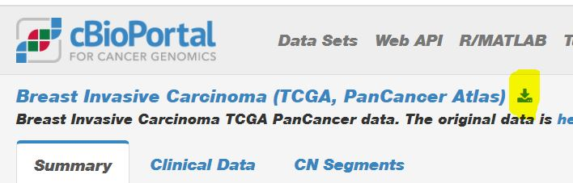

# BMEG 310 Project Overview

## Change Log
Here you will see the list of latest changes in the document.

Nov 3 (Ali Bashashati): You will only need to use the mutation, expression and clinical data. No other datasets (e.g., methylation, miRNA, etc.) are expected to be used.

Nov 3  (Ali Bashashati): submission instructions for progress report updated.

Nov 13  (Ali Bashashati): There has been some really good questions about teh project on Piazza. I have tagged them as "good question". It is highly recommended that you take a look at them to get some ideas. You can find them by searching for the questions that have "project" tag and also highlighted by "~ An instructor (Ali Bashashati) thinks this is a good question  ~".

## General:

The BMEG 310 Course Project is worth 50% of the total grade. The purpose of the project is to give students the opportunity to apply their understanding of course fundamentals to real data. Students will be organised into teams and given a TCGA cancer dataset to analyze, with the goal that they will capture biologically relevant trends characteristic of the cancer in question. The project will consist of a design period, where the details of the analysis and research question will be proposed by teams, and an analysis period, where students will have dedicated time to collaborate and produce results. The last 2 weeks of class will have no tutorials/assignments to give students time to do this, and Instructors/TAs will be available to give students feedback on their work and help them refine their analyses.

## Timeline:

**October 14:** Project Teams Announced. Available at [link](https://htmlpreview.github.io/?https://github.com/bmeg310ubc/bmeg310/blob/master/Groups.html)

**TBD:** Group Check In, Project Proposal Due for self-identified projects (not marked, but required)

**November 21:** Progress Report Due (5% of grade)

**December 5:** Oral Presentations (15% of grade)

**December 15:** Github Repo Due (10% of grade), Final Report Due (15% of grade), Peer Feedback Survey Due (5% of grade)

## Teams:

Students are organised into teams of 4-5 to complete the project by random assignment. We have done our best to organise teams so that there is at least one representative of each subdiscipline of BMEG per team. We have also attempted to organise students by time zone, so that students in similar time zones can easily have meetings together. 

*Please reach out to your teammates early on to ensure that it is easy to communicate, and if any issues come up, please let an instructor know as soon as possible.*

- G1-G4:
  - [Breast Invasive Carcinoma (TCGA, PanCancer Atlas)](https://www.cbioportal.org/study?id=brca_tcga_pan_can_atlas_2018)
- G5-G7:
  - [Bladder Urothelial Carcinoma (TCGA, PanCancer Atlas)](https://www.cbioportal.org/study?id=blca_tcga_pan_can_atlas_2018)
- G8-G10:
  - [Liver Hepatocellular Carcinoma (TCGA, PanCancer Atlas)](https://www.cbioportal.org/study?id=lihc_tcga_pan_can_atlas_2018)
- G11-G14:
  - [Lung Squamous Cell Carcinoma (TCGA, PanCancer Atlas)](https://www.cbioportal.org/study?id=lusc_tcga_pan_can_atlas_2018)
- G15-G17:
  - [Kidney Renal Clear Cell Carcinoma (TCGA, PanCancer Atlas)](https://www.cbioportal.org/study?id=kirc_tcga_pan_can_atlas_2018)
- G18-G20:
  - [Prostate Adenocarcinoma (TCGA, PanCancer Atlas)](https://www.cbioportal.org/study?id=prad_tcga_pan_can_atlas_2018)

## Process:

In this project you will perform analysis on a TCGA Cancer dataset similarly to https://pubmed.ncbi.nlm.nih.gov/28988769/. In other words, we would like teams to use methods they have learned in the lectures, tutorials and assignments, such as clustering, regression, classification, differential expression, survival analysis, and visualization methods (among other approaches) to show that some trend of the Cancer type in question may be explained by characteristics of certain genes and the mechanisms in which they are implicated. While there will be expected deliverables for the analysis, groups will be free to choose from different approaches and algorithms to perform their analysis and may investigate any trends they find in the data. Groups will also be expected to interpret the results of their data and propose biological explanations for the trends they see.

### Data:

You will be using datasets from The Cancer Genome Atlas (TCGA) containing variant calls, expression levels, and comprehensive individual data for many patients who underwent treatment for the same cancer type. Each team will be randomly assigned a dataset for analysis. 

Within each dataset are 3 files of importance:

**data_clinical_patient.txt** : contains a list of patients with data on each individual such as Age, Sex, Race, and Survival

**data_mutations_extended.txt** : contains a list of mutations and a list of patients in which they are found for each

**RNA-Seq count matrix** : contains a set of expression levels for all genes for each patient (Dataset can be downloaded following this instruction [here](https://htmlpreview.github.io/?https://github.com/bmeg310ubc/bmeg310/blob/master/Final%20Project/Instruction_TCGA_RNAseq.html)

Get the <u>first two datasets</u> from the link associated with the project name. You will be redirected to a page where you can download all the data as shown here in the upper left corner. First download all the data related to your project as a zip file, then select these two **.txt** files

These files will be used for the bulk of the analysis. All major data preprocessing steps, including dataset normalization, have already been performed for the variant and expression level files, so the remaining analysis steps may all be completed using only R. Given the information available in the patient file, the major areas of investigation will be to tie patient traits to expression levels and mutations of certain genes. One of the major patient traits to explore is the overall survival, which permits survival analysis, although groups are welcome to explore other patient traits if they wish. 

### Research Process:

The research process is the list of steps that are taken to extract relevant information from the data and assess it to look for trends. Groups should take a look at their data and propose an outline of the steps they plan to take during analysis and the type of results to be expected (in the Project Proposal deliverable). This notably should include any preferred classification/clustering/regression algorithms, which patient variables will be used, and how expression and variant data will each be used. This should be organised as a list of steps, ie. a pipeline or workflow, to show how information will be processed each step of the way from the base data to the final result. It is also recommended to develop a timeline for completing each step in the workflow. Instructors will be able to give feedback to make sure the approach is feasible and offer suggestions of improvement.

As teams explore the data, they will need to look for trends related to the activity/mutation of certain genes and the many patient factors which are available. This search will likely take some trial and error as different data factors are investigated and considered (it may be sped up with procedures such as multiple hypothesis testing), but teams should try to formulate a research question detailing how they will design their pipeline to expressly look for these trends. Students may look at other investigations such as the TCGA paper linked to above (in Process section) for inspiration. Again, instructors will review proposals and provide feedback to ensure students are on the right track.

## Deliverables:

**Part 1:** Group Check-in and Project Proposal 
* It is required that all groups create a document either affirming that everyone in the group is able to communicate with one another or outlining any issues with collaboration, such as conflicting time zones, or any other inability to contact any group member. 
* If a group is working with a self-identified topic, such as a different dataset than was assigned (could even be non-cancer), a proposal is mandatory (Due Nov 2nd). It is also required that these groups will give a detailed overview of the contents of their dataset, including the number of patients/individuals for which data is available, the degree of pre-processing which will need to be performed on data to prepare for analysis, and the extent of patient metadata such as traits and survival statistics.

**Part 2:** Progress Report
* This report should be organised and contain the following sections:
    * **Introduction/Abstract:** Should summarize the contents of the report, including an overview of the approach, dataset used, and expected results
    * **Project Goal:** Should provide a clear summary of the result you are hoping to obtain through analysis, as well as the research question on which you are operating. This may be very specific or general, depending on the angle of your investigation, but should convey the importance of your work.
    * **Analysis Plan:** Give a detailed description of your planned workflow and analysis plan including the algorithms you would like to use and the patient variables you would like to investigate.
    * **Challenges:** Use this section to address any difficulties you are encountering, or expect you will encounter. This may include limitations of a current approach or a lack of meaningful results. Please explain why you believe this problem is occurring, and highlight any limitations in your data you have found. You may also include a section for serious computational errors or bugs if they are seriously holding you back, but it would be preferred that most errors encountered are posted to Piazza.
    * **Timeline:** Discuss progress up to this point, as well as a list of tasks that still need to be completed. For each group member, provide a list of work done and tasks to which they have contributed, as well as a list of tasks to which they are assigned moving forwards. Note, writing reports/preparing the presentation are also project tasks and should be listed.
* The report should not be longer than 2 pages in 11 point font Times New Roman.
* Marks will be awarded for the organization of the report contents (20%), clarity of project goal/research questions (30%), completeness of workflow/methods (40%) and organization of project timeline (10%)
* There will be no marks deducted for addition of or lack of any challenges/errors, but professionalism of the assessment of limitations and problems will contribute to workflow and report organization marks. 
* Progress report should be uploaded to github and the link should be sent to the instructors as a direct message on Piazza. Please do not send direct emails.

**Part 3:** Oral Presentations
* A 10-minute presentation of your project, to be pre-recorded and uploaded to Youtube, which should include the following sections:
    * **Project Goal:** An introduction to your dataset, the disease you are investigating, and an explanation of your research question and process. Should provide a clear summary of the result you have attempted to show with your analysis, and should convey the biological and clinical importance of the analysis you have decided to perform.
    * **Methods:** Give a detailed walkthrough of the workflow you have developed. Provide a reason why each component was chosen, and explain how the workflow is suited to the research question you have defined.
    * **Discussion:** Provide a detailed overview of your results through each stage of your analysis. Clearly highlight any information relevant to the overall result you have found, including any challenges you faced with your dataset or workflow. Show how this information has led you to a conclusion regarding the results of your investigations and how this conclusion addresses your research question. If no conclusive result was found, explain why you believe this is the case, citing trends in your data. If you have found important trends in your data related to the genome, propose a biological interpretation of these trends in terms of possible mechanisms. Try to link any biological effects to potential clinical relevance. Finally, it is important to perform a literature search to see if the findings/interpretation/hypotheses identified from your exploratory analysis work are supported by the literature.
* Presentation time should be divided approximately equally among team members so that everyone gets to contribute
* Marks will be awarded for organization of presentation (20%), clarity of visual aspect of presentation (20%), clarity and completeness of project goals, methods, and results (ie. the goal and methods are logical and the results are well explained in the context of the research question) (40%), and 20% for clarity of speaker's explanations and discussion (awarded per individual speaker).
* Marks will not be deducted for inconclusive results. However, it is expected that some result (promising or not) will be obtained, and the presentation should try to explain the context of these results and speak to their origin.
* Your presentations will be peer reviewed by 5 other teams, and your final mark for the presentation will be the aggregate of the peer evaluation (30%) and the teaching team (70%)

**Part 4:** 
1. **Github Repo**
    * A link to a git repository containing any code, relevant figures, or other files, which should be shared with the instructors.
    * Please create a readme.txt with an overview of your project and names of project members, as well as any relevant notes w.r.t file organisation and project results.
    * All code should be in a visible markdown format (markdown or html, Rscript also works) and should be adequately organised so that it is easy to read. Please include comments on major sections or complicated code pieces to explain the function of the code.
    * By the deadline, the github repo should be organised and complete. Any subsequent edits, unless approved, will be ignored.
    * Marks will be awarded for completeness of the code base (50%), and organization and clarity of code (50%)

2. **Final Report** 
    * This report should contain the following sections:
        * **Abstract** Give an overview summarizing the contents of your report with focus on purpose, results, and relevancy of your work.
        * **Introduction** Explain the background of your investigation, including relevant information regarding the cancer in question. Outline the goal of the project including the research question, and explain the importance of your investigation to possible biological and clinical applications.
        * **Methods** Give a detailed explanation of your workflow including the algorithms you have used and the structure of the data with which you are working. Provide reasoning for every choice you have made in the design of your workflow, placing it in the context of the data. Explain how the workflow is suited to the research question you have defined.
        * **Results** Citing relevant figures and tables, summarize the results of your investigation. Use methods of presenting data such as those which have been covered in assignments and tutorials to convey your results concisely and frame any important trends that have been discovered, or use them to highlight a lack of important trends if this was the case.
        * **Discussion** Highlight important trends in your data and explain them both in the context of the data and in the context of biological/environmental factors of the disease where possible. Discuss any challenges which were faced with the dataset and workflow, and explain how they were addressed. Present a conclusion based on the results of the investigation and explain how this addresses the research question.
    * The report should not be longer than 8 pages in 11 point font Times New Roman, including tables and figures.
    * Cite references where relevant. Use IEEE style and include a bibliography at the end of the report. Often a reference or two can help explain the disease or give credence to a trend you see in the data.
    * Marks will be awarded for formatting and organization of the report (10%), clarity of introduction (20%), thoroughness of methods (10%), quality and relevance of tables and figures (20%), clarity of written summary of results (10%), and clarity and completeness of discussion of results (30%). 

3. **Peer Feedback Survey**
    * At the end of the course, students will be required to submit a confidential peer feedback survey, requiring them to rate teammates based on indices such as work contributed to the project, effort to collaborate with teammates, and reliability of communication with others. This will count towards the collaboration portion of the course grade, worth 5%.
    * The collaboration portion of the project will be assessed based on individual contribution to project as evaluated from the progress report, final report, and peer feedback survey, and students who contribute meaningfully to the project and make a strong effort to collaborate and communicate with teammates will receive full marks.
    * **NOTE:** Although the peer feedback section is worth 5%, the teaching team reserves the right to deduct individual project grades beyond this amount if they identify a situation where specific group members have made no significant contribution to the project or deliverables.

**Part 5:** Peer grading of submitted presentations (due Dec 15)
* We will assign each team 5 projects and they will need to watch the submitted videos and mark them according to the criteria for oral presentations. 
* In addition to the peer evaluation, at least two of the teaching team (instructors & TAs) will grade the project. 
* Final grade for the presentation will be the aggregate of the peer evaluation (30%) and teaching team (70%). 
